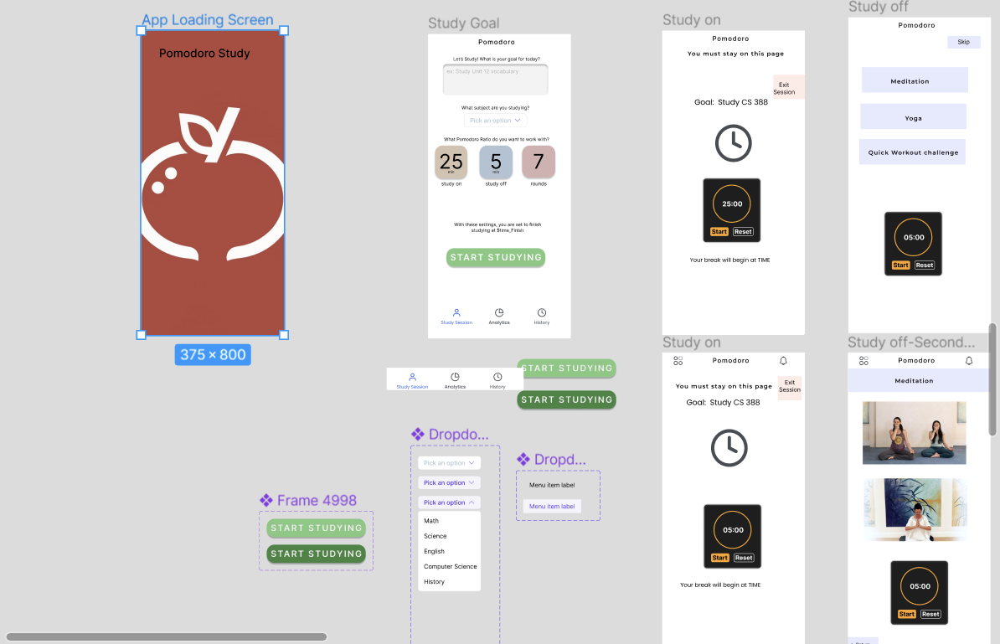

# Milestone 1 - Pomodoro App (Unit 7)

## Table of Contents

1. [Overview](#Overview)
1. [Product Spec](#Product-Spec)
1. [Wireframes](#Wireframes)

## Overview

### Description

[Pomodoro is a study method where the student studies intensely for a select amount of time, followed by a set time of rest (ex: 30 minutes on, 10 minutes off). This app would track a user's study habits as well as track their Pomodoro Session. This would also allow the user to set their own pomodoro ratios and recieve notifcations when their study time is on or off. During the "study on" portion of the Pomodoro, there will be some motion control aspect implemented where if you swipe away from the study app, the "study on" time will reset back to 0.]

### App Evaluation

[Evaluation of your app across the following attributes]
- **Category:Education and studying**
- **Mobile: Mobile is helpful for the notifcation aspect and for on the go convience. This allows users to easily track their habits, and form healthier ones.**
- **Story:Creates an all in one environment for students to optimize their study strategies**
- **Market:Students hoping to develop better study habits, especially those who are easily distracted**
- **Habit:Students would use this everytime the plan on studying. They can check the app daily to track their study habits and improve.**
- **Scope:V1 would be an app where users could track their own individual study habits, set custom Pomodoro session, and study sessions enforced by tracking the lifecycle of the app (i.e. if the student exits the app).Additionally, users would be able to have analytics about their study habits. V2 would include a planning system where users could plan what they will study and keep track of the subjects they've studied for already V3 would include a login/logout system where students could track their study habits that is sharable with their friends V4 would include a reward system for students who study in streaks or meet their study goals**

## Product Spec

### 1. User Features (Required and Optional)

**Required Features**

1. User can set their Pomodoro Ratio and their goal to accomplish for study session
2. Timer with 2 pages (study on and study off). Both pages will show a large timer. 
   - "study on" - if the user swipes away from the app the timer will reset (lifecycle methods)
   - "study off" - the user will have an activity to perform during their break (use API here)
4. Track Study Habits. 
   - A calendar feature to track study habits and future exams
   - User can use this calendar to reference what they've studied in past sessions
5. Notifcations to track when the progress of the study session. Notify when the study session will begin and end (use FireBase or Library recommended by Dhruval for in app notifcations)

**Optional Features**

1. Interesting visuals to play during the Timer (use TA Dhruval's recommendations for Kotlin libraries for nice animations)
2. Settings Feature
3. Reward system (to track stages)
4. A login/logout system
5. A sharable page for students to share with their friends their study habits

### 2. Screen Archetypes

- Set Study Goals Page (Hope)
  - User Story 1
- "Study on" Page (Mike)
  -  User Story 2
- "Study off" Page (Eddi)
  - User Story 2
- Analytics Page (Nathanel)
  - User Story 4
- Specifc Study Session Page (Chloe)
  - User Story 4

### 3. Navigation

**Tab Navigation** (Tab to Screen)

* [Home]
* [Analytics]
* [History]

**Flow Navigation** (Screen to Screen)

- [Home]
  - [Study Timer]
  - [Break Page]
- [Analytics]
- [History]

## Wireframes

[Add picture of your hand sketched wireframes in this section]

 
 
### [BONUS] Digital Wireframes & Mockups
https://www.figma.com/file/orV5IoLypk69jQMqeaO5Df/Pomodoro?type=design&node-id=58%3A2661&mode=design&t=YrCShyo2FbOC76Xy-1

### [BONUS] Interactive Prototype

 

# Milestone 2 -Project planning (Unit 8)
All sprints were planned for the project
## GitHub Project board
    

## Issue cards
Milestone 1
- 
Milestone 2
- 
Milestone 3
-
Milestone 4
- 
## Issues worked on this sprint (sprint 1)

- Bottom Nav Bar
- Break Page
- Loading Screen
- Timer
- Media Break Page
- History Page
- Timer Page

 

# Milestone 3 - Build Sprint 2 (Unit 9)

## GitHub Project board

[Add screenshot of your Project Board with the updated status of issues for Milestone 3. Note that these should include the updated issues you worked on for this sprint and not be a duplicate of Milestone 2 Project board.] 

## Completed user stories

- List the completed user stories from this unit
- List any pending user stories / any user stories you decided to cut
from the original requirements

[Add video/gif of your current application that shows build progress]

## App Demo Video

- Embed the YouTube/Vimeo link of your Completed Demo Day prep video
